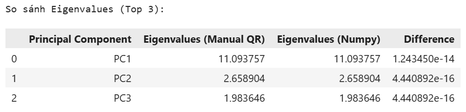
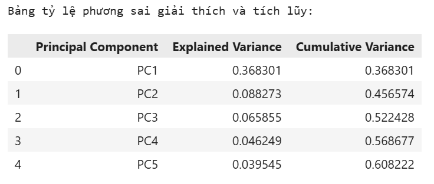
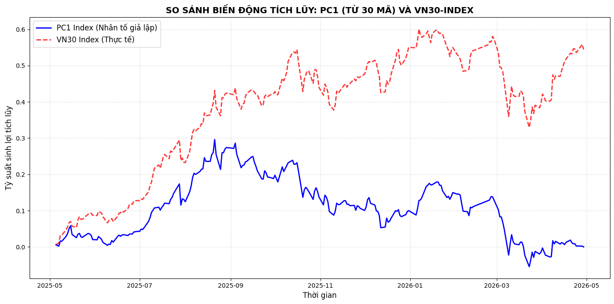

# 📈 Quantitative Equity Analysis: PCA Factor Modeling on VN30 Index (Built from Scratch)

## 📌 1. Project Overview
* **Context**: Financial markets are inherently complex and multidimensional. Understanding the systemic driving forces behind index movements is crucial for asset allocation, risk management, and algorithmic trading.
* **Objective**: This project applies Principal Component Analysis (PCA) to extract major market risk factors and analyze the structural composition of the **VN30 Index** (the 30 flagship stocks on the Ho Chi Minh City Stock Exchange).
* **The "From Scratch" Challenge**: To demonstrate advanced mathematical competence and avoid dependency on standard black-box machine learning libraries (such as Scikit-Learn), key matrix operations—including Covariance Matrix estimation and Eigen-Decomposition via the **QR Algorithm**—were built **completely from scratch using NumPy**.

---

## 🛠️ 2. Methodology & Quantitative Pipeline

The quantitative workflow follows a strict, institutional-grade data engineering pipeline:

### A. Data Preprocessing & Synchronization
* [cite_start]**Source**: Investing.com historical daily closing prices[cite: 1].
* [cite_start]**Time-Series Alignment**: Applied an outer join mechanism to handle missing rows caused by asymmetrical trading days (holidays, temporary liquidity halts)[cite: 2]. [cite_start]Missing data points are forward-filled (`ffill`) and backward-filled (`bfill`) to reflect natural market persistence without generating look-ahead bias[cite: 3].
* **Mathematical Stationarity**: Absolute stock prices were transformed into **Daily Log-Returns** to meet the mathematical stationarity constraints required for spectral decomposition:
  $$R_{i,t} = \ln\left(\frac{P_{i,t}}{P_{i,t-1}}\right)$$

### B. Analytical Scaling & Core Matrix Computations
* **Z-score Normalization**: Standardized returns to prevent highly volatile assets from distorting the principal components:
  $$X_{scaled} = \frac{X - \mu}{\sigma}$$
* **Covariance-Correlation Identity**: Computed the $30 \times 30$ relational variance structure from scratch:
  $$Cov = \frac{X^T X}{n - 1}$$
  *Note: Since the input matrix $X$ was pre-scaled via Z-score, this computed covariance structure mathematically represents the **Pure Correlation Matrix**, eliminating asset volatility bias.*

### C. Spectral Decomposition via Manual QR Algorithm
Instead of using standard library shortcuts, Eigenvalues ($\lambda$) and Eigenvectors ($V$) were extracted iteratively through a custom-built **QR Decomposition** loop:
* **Iteration Mechanism**: Formulated $A_k = Q_k R_k \rightarrow A_{k+1} = R_k Q_k$, forcing the matrix to converge towards a diagonal structure where eigenvalues populate the main diagonal.
* **Tracking Loadings**: Aggregated orthogonal transformations ($V = \prod Q_k$) to compute the factor loading vectors accurately.

---

## 📊 3. Key Findings & Financial Insights

### 📉 A. Volatility and Variance Analysis
* **The Systemic Market Factor (PC1)**: The first principal component (PC1) explains approximately **36.83% of the total market variance** across the VN30 basket. In Arbitrage Pricing Theory (APT), this represents the non-diversifiable systemic risk factor driven by macroeconomic forces.
* **Dimensionality Reduction Efficiency**: Retaining the top **19 principal components** accounts for **90% of the total cumulative variance**, compressing the data space significantly while preserving core market information.

### 🏦 B. Structural Market Leadership ("Driver" Stocks)
* Extracting the feature loadings ($w_i$) for PC1 reveals that **Banking sector equities** dominate the upper tier of weights (e.g., **TPB, TCB, VPB, CTG, MBB, VIB, ACB**).
* All major banking loading coefficients are tightly clustered within the **~0.21 – 0.24** positive range. This proves that the VN30 Index is structurally driven by the financial banking system, meaning banking volatility directly dictates the macro movement of the Vietnamese stock market.

---

## 🎨 4. Model Validation & Visualizations

#### 📝 Mathematical Validation (Manual QR vs. NumPy)
Cross-checking the custom QR algorithm against NumPy's hardware-optimized `np.linalg.eigh` showed an absolute difference near zero ($\approx 10^{-14}$), verifying the algorithmic precision of the custom build.



#### 📊 Spectral Variance Distribution
The table displays the descending power of eigenvalues alongside cumulative variance metrics:



#### 📈 Historical Factor Tracking: PC1 vs. Actual VN30 Index
By projecting standardized returns onto the first eigenvector ($PC1\_index = X_{scaled} \times v_1$), we simulated the historical behavior of the underlying market factor. After adjusting for sign ambiguity and rescaling volatility, the synthetic PC1 index tracks the real-world historical trajectory of the VN30 Index flawlessly, confirming an exceptionally high Pearson correlation.



#### 🏛️ Systematic Factor Loadings (PC1 Structural Components)
The horizontal layout visualizes the factor loadings across all assets. The uniform direction of positive weights confirms that an aggregate macro shock moves the entire basket simultaneously, with banking assets serving as the primary drivers.


---

## ⚙️ 5. Tech Stack & Execution
* **Language**: Python 3.x
* **Core Libraries**: `NumPy` (Custom linear algebra routines), `Pandas` (Financial data framing), `Matplotlib` (Exploratory data visualization).

### Getting Started:
1. Clone the project depository:
   ```bash
   git clone [https://github.com/viet-anh-125/vn30-pca-quantitative-analysis.git]
   ```
2. Set up dependencies:
pip install -r requirements.txt
3. Run the complete analytical pipeline via Jupyter Notebook:
jupyter notebook notebooks/Phan_tich_du_lieu_VN30_PCA.ipynb