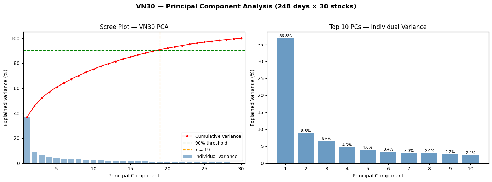
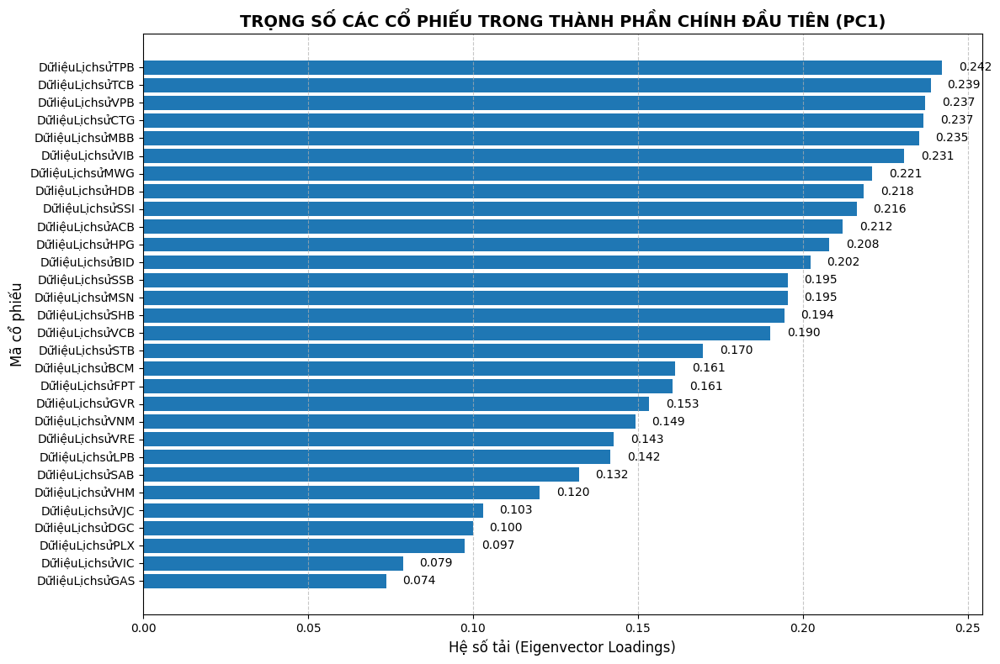

# VN30 Stock Market Structural Analysis via PCA

> Final-term quantitative finance project — analyzing the structural dynamics
> of the Vietnamese stock market using a custom-built PCA pipeline implemented
> from scratch, without relying on any ML libraries.

**Institution:** Banking University of Ho Chi Minh City (HUB)
**Course:** Data Analysis for Finance

---

## Overview

This project applies PCA to the **30 constituent stocks of the VN30 index**
to decompose market variance, identify systemic risk factors, and quantify
the dominance of the banking sector over overall index volatility.

The entire PCA algorithm — from covariance matrix construction to
eigenvalue decomposition — is built manually using NumPy, then validated
against standard library outputs.

---

## Key Results

| Metric | Value |
|---|---|
| Input matrix | 248 trading days × 30 stocks |
| PC1 explained variance | **36.83%** |
| PCs needed for 90% variance | **19 components** |
| PC1 ↔ VN30-Index correlation | **0.9192 (Pearson)** |
| QR vs NumPy eigenvalue diff | ~1e-14 (machine epsilon) |

---

## Scree Plot



---

## PC1 vs VN30-Index (Cumulative Returns)


> PC1 achieves **0.9192 Pearson correlation** with the actual VN30-Index,
> confirming it functions as a statistical market factor proxy.

---

## PC1 Factor Loadings



| Rank | Ticker | Loading | Sector |
|---|---|---|---|
| 1 | TPB | 0.2422 | Banking |
| 2 | TCB | 0.2388 | Banking |
| 3 | VPB | 0.2372 | Banking |
| 4 | CTG | 0.2367 | Banking |
| 5 | MBB | 0.2352 | Banking |
| 6 | VIB | 0.2307 | Banking |
| 7 | MWG | 0.2210 | Retail |
| 8 | HDB | 0.2185 | Banking |
| 9 | SSI | 0.2163 | Securities |

All loadings are **positive** and range narrowly between **0.21–0.24**,
indicating PC1 captures a uniform, sector-wide co-movement — not any
individual stock effect.

**Conclusion:** PC1 = Systemic Market Risk Factor. The banking sector
dominates VN30 volatility, consistent with their heavy index weighting.

---

## Methodology

### 1. Data Preprocessing
- Source: **Investing.com** — daily closing prices for all 30 VN30 stocks
- Date format: `dd/mm/yyyy`, cleaned via `strptime`
- Merged all tickers on common trading date index
- Applied **forward-fill** to handle missing sessions (holidays, halts)
- Converted prices to **daily log-returns** for stationarity

### 2. Z-Score Normalization
Standardize each stock to mean=0, std=1:
X_scaled = (X - mean) / std
When computed on Z-score normalized data, the covariance matrix is
mathematically equivalent to the **correlation matrix** — enabling pure
structural comparison across stocks.

### 3. Covariance Matrix
Cov = (X_scaled.T @ X_scaled) / (n - 1)
Shape: (30, 30)

### 4. Eigendecomposition — Two Methods

**Method A: NumPy (library)**
```python
eigenvalues, eigenvectors = np.linalg.eigh(cov_matrix)
```

**Method B: Manual QR Algorithm (500 iterations)**
```python
def qr_manual(A, steps=500):
    V = np.eye(A.shape[0])
    A_k = A.copy()
    for _ in range(steps):
        Q, R = np.linalg.qr(A_k)
        A_k = R @ Q   # eigenvalues emerge on diagonal
        V = V @ Q     # eigenvectors accumulate
    return np.diag(A_k), V
```

Both methods produce **numerically identical results**:

| PC | Manual QR | NumPy | Difference |
|---|---|---|---|
| PC1 | 11.093757 | 11.093757 | 1.24 × 10⁻¹⁴ |
| PC2 | 2.658904 | 2.658904 | 4.44 × 10⁻¹⁶ |
| PC3 | 1.983646 | 1.983646 | 4.44 × 10⁻¹⁶ |

### 5. Dimensionality Reduction
Select k=19 components (threshold: 90% cumulative variance):
X_pca = X_scaled @ W    # W shape: (30, 19)
Output shape: (248, 19)
### 6. PC1 Reconstruction & Validation
PC1_returns = X_scaled @ v1   # v1 = first eigenvector
Pearson correlation with VN30-Index = 0.9192

---

## Project Structure
vn30-pca-analysis/
├── README.md
├── requirements.txt
├── .gitignore
├── notebook/
│   └── vn30_pca_analysis.ipynb
└── assets/
├── scree_plot.png
├── pc1_vs_vn30.png
└── pc1_loadings.png
---

## Data

Stock CSV files are **not included** in this repo due to size.

To reproduce:
1. Go to https://www.investing.com
2. Search each VN30 ticker → Historical Data → Download CSV
3. Place all CSV files in a Google Drive folder named `VN30/`
4. Update `folder_path` in the notebook to your Drive path

---

## How to Run

1. Upload notebook to Google Colab
2. Mount Google Drive and ensure CSV files are in `/MyDrive/VN30/`
3. Run all cells sequentially

```bash
# Or run locally:
git clone https://github.com/viet-anh-125/vn30-pca-analysis.git
cd vn30-pca-analysis
pip install -r requirements.txt
jupyter notebook notebook/vn30_pca_analysis.ipynb
```

---

## Tech Stack

| Category | Tools |
|---|---|
| Language | Python 3 |
| Numerical computing | NumPy |
| Data manipulation | Pandas |
| Visualization | Matplotlib |
| Runtime | Google Colab + Google Drive |
| PCA implementation | **From scratch** — manual QR Algorithm (500 iterations) |
| Validation | `np.linalg.eigh` |

---

## Author

**Đào Việt Anh** 